# 自作レンダラー

Vulkanベースの自作レンダラー

## 成果物
### Phase 1
#### Hello Triangle
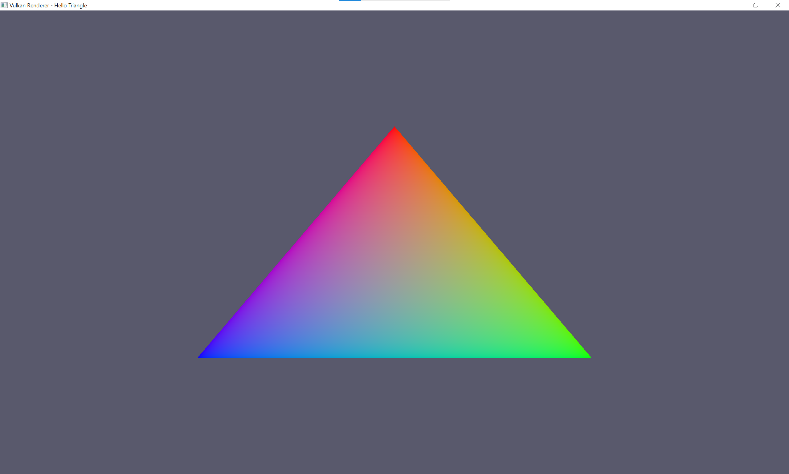

### Phase 2
#### Mario Mario
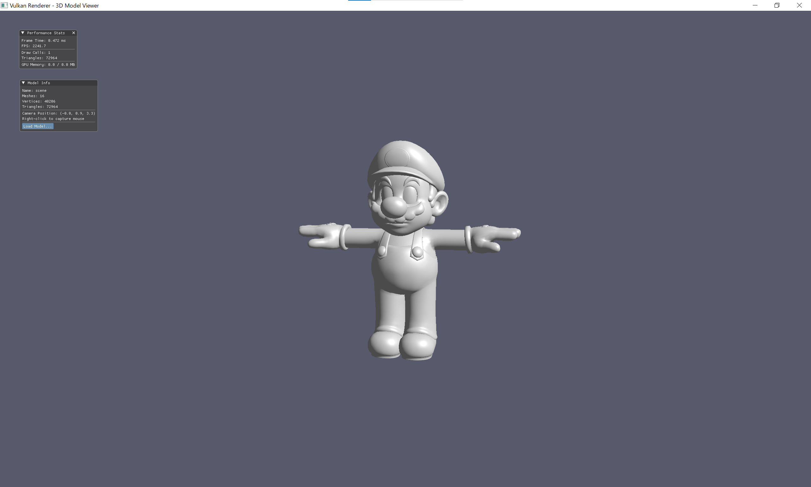

#### Rabbit Maid
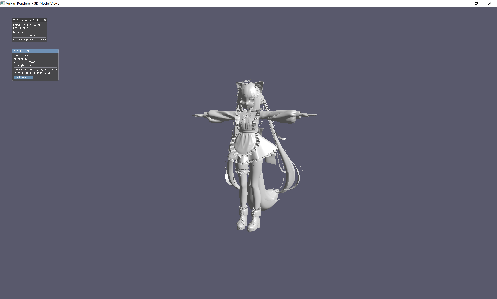

### Bunny
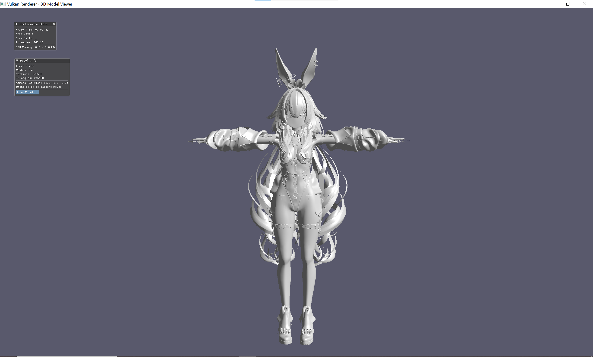

### Neko Mimi


#### Butterfly Areana Of Valor
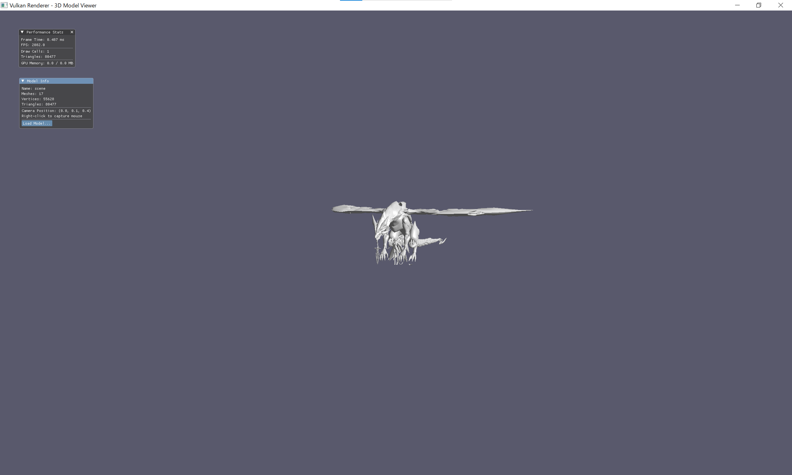

#### A Contortionist Dancer
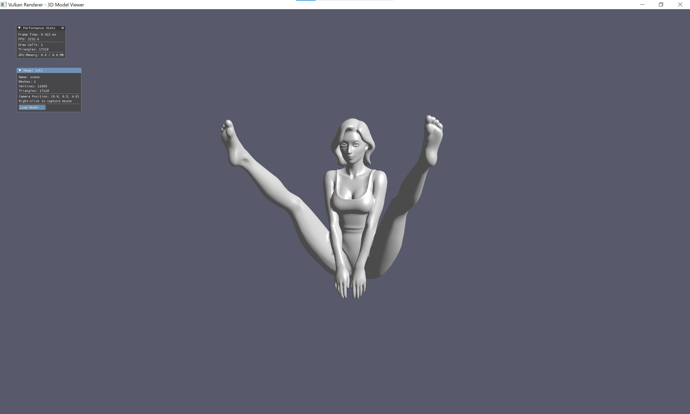

#### Fortnite Back to The Future Time Machine
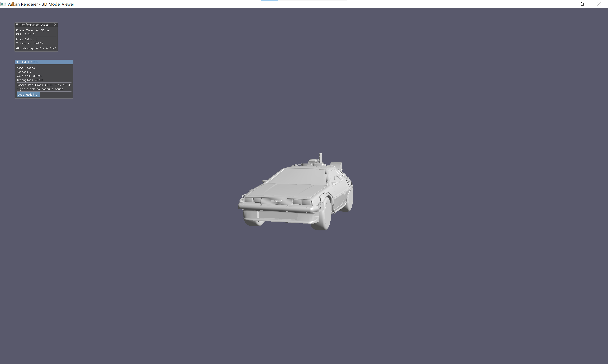

### Phasee 3
#### Mario Mario
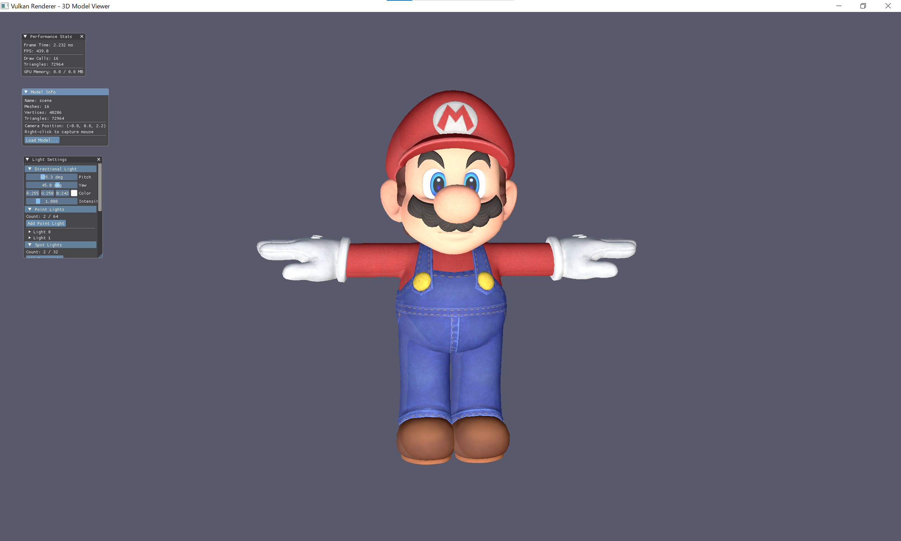

#### Rabbit Maid
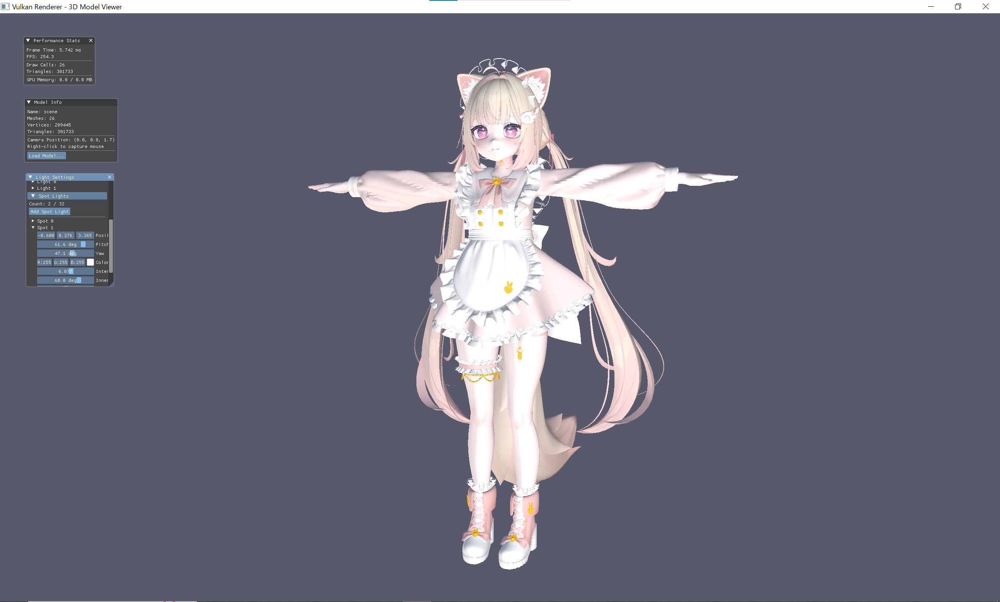

### Bunny
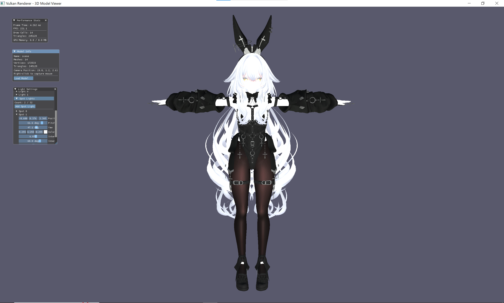

### Neko Mimi
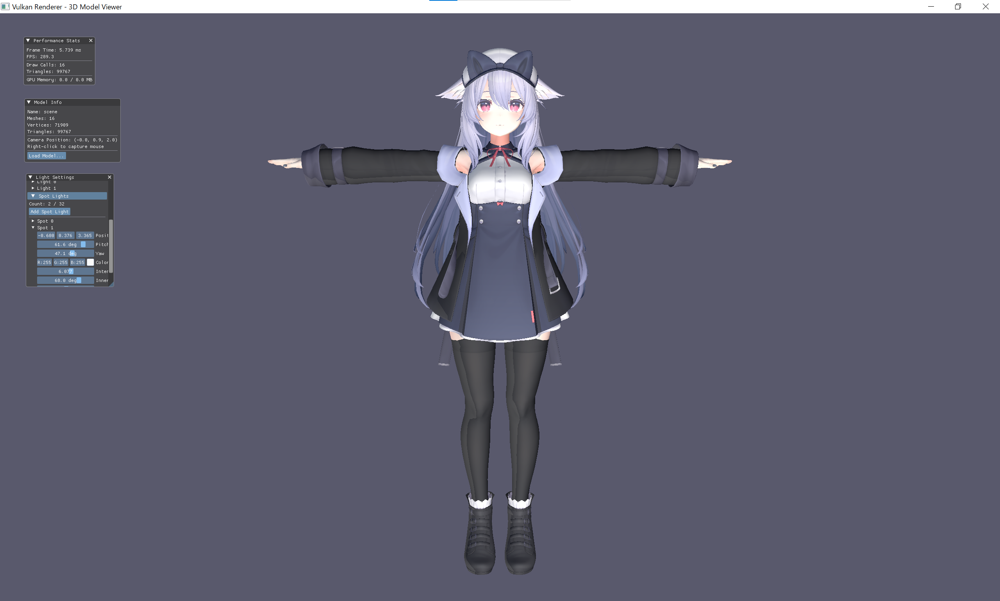

#### Butterfly Areana Of Valor
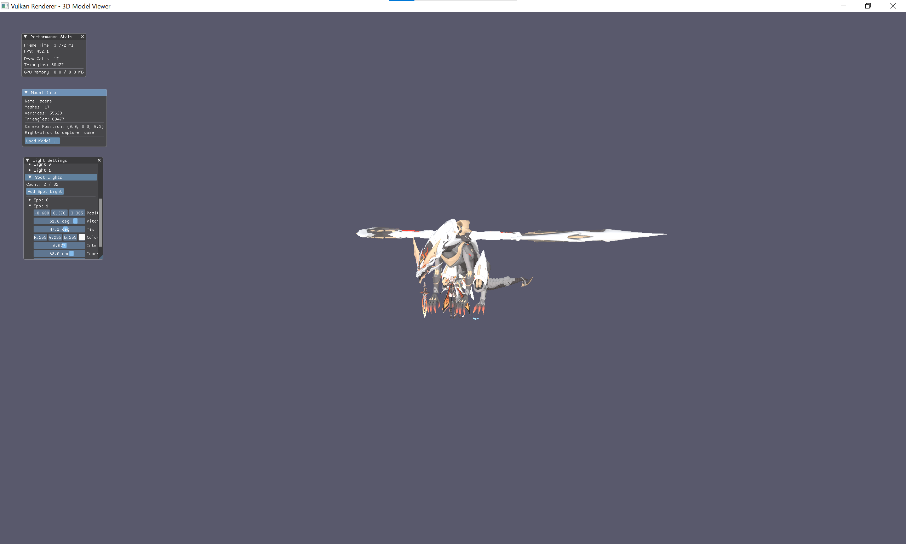

#### A Contortionist Dancer
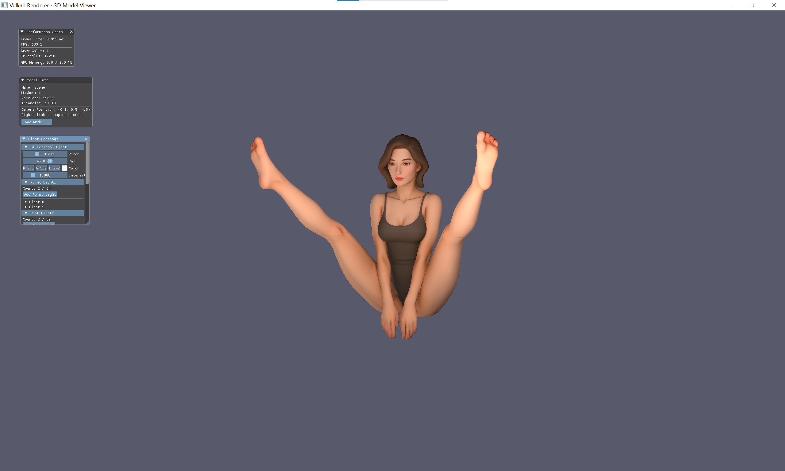

#### Fortnite Back to The Future Time Machine
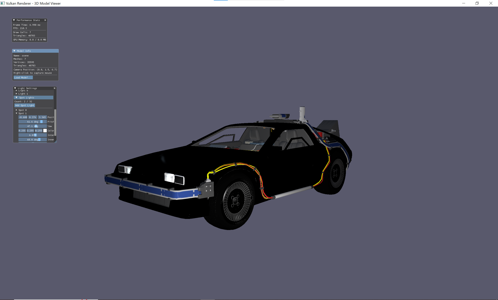

## 必要環境

- CMake 3.20以上
- C++20対応コンパイラ（MSVC, GCC, Clang）

## ビルド

```bash
# 構成（Releaseビルド）
cmake -S . -B build -DCMAKE_BUILD_TYPE=Release

# ビルド
cmake --build build
```

## アプリケーション実行

```bash
# Windowsの場合
./build/VulkanRenderer.exe

# または
build/VulkanRenderer.exe
```

## テスト実行

```bash
# 全テスト実行
ctest --test-dir build

# 詳細出力
ctest --test-dir build -V

# 失敗時のみ出力
ctest --test-dir build --output-on-failure

# 名前でフィルタ
ctest --test-dir build -R LogTest
```

## HLSLシェーダーコンパイル

シェーダーはアプリケーション起動時に自動的にDXCでコンパイルされますが、手動でコンパイルする場合は以下のコマンドを使用します。

### 前提条件

- Vulkan SDKがインストールされていること（DXCが含まれています）
- 環境変数 `VULKAN_SDK` が設定されているか、`dxc.exe` がPATHに存在すること

### コンパイルコマンド

```bash
# 頂点シェーダー
dxc -T vs_6_0 -E main -spirv -fspv-target-env=vulkan1.3 -O3 \
    -I "shaders/hlsl" \
    "shaders/hlsl/vertex/model.hlsl" \
    -Fo "model_vs.spv"

# ピクセル（フラグメント）シェーダー
dxc -T ps_6_0 -E main -spirv -fspv-target-env=vulkan1.3 -O3 \
    -I "shaders/hlsl" -I "shaders/hlsl/pixel" \
    "shaders/hlsl/pixel/model_pbr_ibl.hlsl" \
    -Fo "model_pbr_ibl_ps.spv"

# コンピュートシェーダー
dxc -T cs_6_0 -E main -spirv -fspv-target-env=vulkan1.3 -O3 \
    -I "shaders/hlsl" -I "shaders/hlsl/compute" \
    "shaders/hlsl/compute/equirect_to_cubemap.hlsl" \
    -Fo "equirect_to_cubemap_cs.spv"
```

### DXCオプション説明

| オプション | 説明 |
|-----------|------|
| `-T <profile>` | シェーダープロファイル（vs_6_0, ps_6_0, cs_6_0, gs_6_0, hs_6_0, ds_6_0） |
| `-E <name>` | エントリーポイント関数名（通常は `main`） |
| `-spirv` | SPIR-V形式で出力 |
| `-fspv-target-env=vulkan1.3` | Vulkan 1.3をターゲット |
| `-O3` | 最適化レベル（0=なし, 3=最大） |
| `-I <path>` | インクルードディレクトリ |
| `-Fo <file>` | 出力ファイルパス |

### Windowsでの実行例

```powershell
# Vulkan SDKのパスを使用
& "$env:VULKAN_SDK\Bin\dxc.exe" -T ps_6_0 -E main -spirv -fspv-target-env=vulkan1.3 -O3 `
    -I "shaders/hlsl" -I "shaders/hlsl/pixel" `
    "shaders/hlsl/pixel/model_pbr_ibl.hlsl" `
    -Fo "model_pbr_ibl_ps.spv"
```
